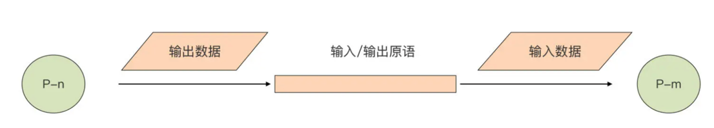

# golang101

## notes

### 1、设计理念

1、与主流静态语言不同，在 Go 语言变量声明中，类型是放在变量名的后面的，这样做有什么好处？

- [Go's Declaration Syntax](https://blog.go-zh.org/gos-declaration-syntax)

### 2、基本数据类型

1、Go语言中的浮点类型的二进制表示是怎样的？

1. [IEEE 754 标准](https://zh.wikipedia.org/wiki/IEEE_754)

2、字符串的内存表示

```text
// StringHeader是一个string的运行时表示
type StringHeader struct {
Data uintptr
Len  int
}
```

3、字符串拼接性能对比

- 如果能知道拼接字符串的个数，那么使用bytes.Buffer和strings.Builder的Grows申请空间后，性能是最好的
- 如果不能确定长度，那么bytes.Buffer和strings.Builder也比"+"和fmt.Sprintf性能好很多
- strings.Builder更合适，因为bytes.Buffer 转化为字符串时重新申请了一块空间，存放生成的字符串变量，而 strings.Builder
  直接将底层的 []byte 转换成字符串类型返回

4、常量

- Go中的常量具备：无类型常量(值默认)、隐式转换特点
- 常量和iota常用于枚举
- iota使用需评估合理性，保证代码可读性。比如：标准库syscall下有大量定义的常量，如果使用iota会看得头晕

### 3、复合数据类型

1、数组与切片

- 数组传递的是值，切片传递的是引用

切片的内存表示如下

```text
type slice struct {
array unsafe.Pointer // 指向底层数组的指针
len   int
cap   int
}
```


2、数组切片化

```text
arr := [10]int{1, 2, 3, 4, 5, 6, 7, 8, 9, 10}
sl := arr[3:7:9]  // 3是下标, len=high-low=7-3=4, cap=max-low=9-3=6
```

3、map类型基础

- key 的类型必须支持"=="和"!="两种比较操作符，函数类型、map 类型自身，以及切片只支持与 nil 的比较，而不支持同类型两个变量的比较
- 因为它内部实现的复杂性，无法"零值可用"
- delete 函数是从 map 中删除键的唯一方法
- 程序逻辑千万不要依赖遍历 map 所得到的的元素次序
- 和切片类型一样，map 也是引用类型。数组传递的是值，切片和map传递的是引用

4、map类型内部实现


- 初始状态：map类型初始化后对应的是 runtime.hmap 类型的指针, 真正用来存储键值对数据的是 bucket。 每个 bucket
  由三部分组成，从上到下分别是 tophash 区域、key 存储区域和 value 存储区域。
  每个 bucket 中存储的是 Hash 值低 bit 位数值相同的元素, 默认的元素个数为 BUCKETSIZE（值为8，Go 1.17 版本中在
  $GOROOT/src/cmd/compile/internal/reflectdata/reflect.go 中定义，与 runtime/map.go 中常量 bucketCnt 保持一致）。
  当某个 bucket 的 8 个空槽 slot 都填满了，且 map 尚未达到扩容的条件的情况下，运行时会建立 overflow bucket，并将这个
  overflow bucket 挂在上面 bucket 末尾的 overflow 指针上，这样两个 buckets 形成了一个链表结构，直到下一次 map
  扩容之前，这个结构都会一直存在。
  
- tophash 区域：向 map 插入一条数据，或者是从 map 按 key 查询数据的时候，运行时都会使用哈希函数对 key
  做哈希运算，并获得一个哈希值（hashcode）
  运行时会把 hashcode"一分为二"来看待，其中低位区的值用于选定 bucket，高位区的值用于在某个 bucket 中确定 key 的位置，示意图如下。
  每个 bucket 的 tophash 区域其实是用来快速定位 key 位置的，这样就避免了逐个 key 进行比较这种代价较大的操作，是一种空间换时间的思路。
  
- key 存储区域：运行时在分配 bucket 的时候需要知道 key 的 Size，如何知晓呢？
  当声明一个 map 类型变量，比如 `var m map[string]int` 时，Go 运行时就会为这个变量对应的特定 map 类型，生成一个
  runtime.maptype 实例，如果这个实例已经存在，就会直接复用。Go 运行时就是利用 maptype 参数中的信息确定 key 的类型和大小的

```text
type maptype struct {
	typ        _type
	key        *_type
	elem       *_type
	bucket     *_type // internal type representing a hash bucket
	keysize    uint8  // size of key slot
	elemsize   uint8  // size of elem slot
	bucketsize uint16 // size of bucket
	flags      uint32
}
```

- value 存储区域：和 key 一样，这个区域的创建也是得到了 maptype 中信息的帮助。
  Go 运行时采用了把 key 和 value 分开存储的方式，而不是采用一个 kv 接着一个 kv 的 kv
  紧邻方式存储，这带来的其实是算法上的复杂性，但却减少了因内存对齐带来的内存浪费
  
- 此外：如果 key 或 value 的数据长度大于一定数值，那么运行时不会在 bucket 中直接存储数据，而是会存储 key 或 value 数据的指针
  目前 Go 运行时定义的最大 key 和 value 的长度是这样的：

```text
// $GOROOT/src/runtime/map.go
const (
    maxKeySize  = 128
    maxElemSize = 128
)
```

5、map扩容
Go 运行时的 map 实现中引入了一个 LoadFactor（负载因子），当 count > LoadFactor * 2^B 或 overflow bucket 过多时，运行时会自动对
map 进行扩容。目前 Go 最新 1.17 版本 LoadFactor 设置为 6.5

- 如果是因为 overflow bucket 过多导致的扩容，实际上运行时会新建一个和现有规模一样的 bucket 数组，然后在 assign 和 delete
  时做排空和迁移
- 如果是因为当前数据数量超出 LoadFactor 指定水位而进行的扩容，那么运行时会建立一个两倍于现有规模的 bucket 数组，
  但真正的排空和迁移工作也是在 assign 和 delete 时逐步进行的。
  原 bucket 数组会挂在 hmap 的 oldbuckets 指针下面，直到原 buckets 数组中所有数据都迁移到新数组后，原 buckets 数组才会被释放。
  
- 因为 map 可以自动扩容，map 中数据元素的 value 位置可能在这一过程中发生变化，所以 Go 不允许获取 map 中 value
  的地址，这个约束是在编译期间就生效的。

### 4、结构体与接口

1、结构体基础

- 只嵌入其他结构体内容，而不添加字段名，可使用匿名嵌入字段
- 零值可用：如果一种类型采用零值初始化得到的零值变量，是有意义的，而且是直接可用的，我称这种类型为“零值可用”类型
- 通常自定义的结构体非"零值可用"，但Go标准库和运行时中有很多零值可用的结构体，如：sync.Mutex、bytes.Buffer
- 结构体方法的 receiver 参数的基类型本身不能为指针类型或接口类型，方法声明要与 receiver 参数的基类型声明放在同一个包内
- 结构体方法本质：一个以方法的 receiver 参数作为第一个参数的普通函数
- 结构体 T 和 *T 的方案，无论是通过 T{} 还是 &T{} 都能够调用，但要注意通过 for range 遍历 []T 时调用 receiver 为 *T 的方法
- 方法集合：通过反射可知 *T 的方法集合中包含所有 T 的方法，但 T 方法集合中不包含 *T 的方法，该特性可用于判断 T 类型是否需要实现
  某个接口从而决定方法的 receiver 是使用 T 还是 *T
- 结构体类型的方法集合，包含嵌入的接口类型和结构体类型(嵌入结构体不能指定字段名)的方法集合
- defined 的结构体类型不包含原结构体类型方法，但 alias 类型包括

2、[结构体内存对齐](https://geektutu.com/post/hpg-struct-alignment.html)
> 所谓内存对齐，指的就是各种内存对象的内存地址不是随意确定的，必须满足特定要求

- 对于各种基本数据类型来说，它的变量的内存地址值必须是其类型本身大小的整数倍，比如，一个 int64 类型的变量的内存地址，应该能被
  int64 类型自身的大小，也就是 8 整除；一个 uint16 类型的变量的内存地址，应该能被 uint16 类型自身的大小，也就是 2 整除。
- 对于结构体而言，它的变量的内存地址，只要是它最长字段长度与系统对齐系数两者之间较小的那个的整数倍就可以了。
  但对于结构体类型来说，我们还要让它每个字段的内存地址都严格满足内存对齐要求。
- unsafe.Sizeof(t) 可以获取内存占用字节数

以结构体类型 T 为例

```text
type T struct {
    b byte
    i int64
    u uint16
}
```

计算过程如图所示，最后6个字节的填充是为了保证下一个基本类型、复合类型能被整除


3、接口

- nil接口未必等于nil，只有值类型和值同时等于nil的接口才等于nil
- 接口变量的内部表示，eface 用于表示没有方法的空接口（empty interface）类型变量，
  iface 用于表示其余拥有方法的接口 interface 类型变量
    - `_type` 该接口类型变量的动态类型的信息
    - `data` 指向当前赋值给该接口类型变量的动态类型变量的值
    - 判断两个接口类型变量是否相同，只需要判断 _type/tab 是否相同，以及 data 指针指向的内存空间所存储的数据值是否相同就可以
      这里要注意不是 data 指针的值，而是 data 指向的内存空间所存储的数据值

```text
// $GOROOT/src/runtime/runtime2.go
type iface struct {
    tab  *itab
    data unsafe.Pointer
}
type eface struct {
    _type *_type
    data  unsafe.Pointer
}

// $GOROOT/src/runtime/type.go
type _type struct {
    size       uintptr
    ptrdata    uintptr // size of memory prefix holding all pointers
    hash       uint32
    tflag      tflag
    align      uint8
    fieldAlign uint8
    kind       uint8
    // function for comparing objects of this type
    // (ptr to object A, ptr to object B) -> ==?
    equal func(unsafe.Pointer, unsafe.Pointer) bool
    // gcdata stores the GC type data for the garbage collector.
    // If the KindGCProg bit is set in kind, gcdata is a GC program.
    // Otherwise it is a ptrmask bitmap. See mbitmap.go for details.
    gcdata    *byte
    str       nameOff
    ptrToThis typeOff
}


// $GOROOT/src/runtime/runtime2.go
type itab struct {
    inter *interfacetype
    _type *_type
    hash  uint32 // copy of _type.hash. Used for type switches.
    _     [4]byte
    fun   [1]uintptr // variable sized. fun[0]==0 means _type does not implement inter.
}

// $GOROOT/src/runtime/runtime2.go
type itab struct {
    inter *interfacetype
    _type *_type
    hash  uint32 // copy of _type.hash. Used for type switches.
    _     [4]byte
    fun   [1]uintptr // variable sized. fun[0]==0 means _type does not implement inter.
}

// $GOROOT/src/runtime/type.go
type interfacetype struct {
    typ     _type
    pkgpath name
    mhdr    []imethod
}
```

4、接口应用的几种模式
以接口为"关节"的水平组合方式，可以将各个垂直组合出的类型“耦合”在一起，从而编织出程序静态骨架

- 基本模式：`func YourFuncName(param YourInterfaceType)`
  
- 创建模式：接受接口，返回结构体

```text
// $GOROOT/src/sync/cond.go
type Cond struct {
    ... ...
    L Locker
}

func NewCond(l Locker) *Cond {
    return &Cond{L: l}
}

// $GOROOT/src/log/log.go
type Logger struct {
    mu     sync.Mutex 
    prefix string     
    flag   int        
    out    io.Writer  
    buf    []byte    
}

func New(out io.Writer, prefix string, flag int) *Logger {
    return &Logger{out: out, prefix: prefix, flag: flag}
}

// $GOROOT/src/log/log.go
type Writer struct {
    err error
    buf []byte
    n   int
    wr  io.Writer
}

func NewWriterSize(w io.Writer, size int) *Writer {
    // Is it already a Writer?
    b, ok := w.(*Writer)
    if ok && len(b.buf) >= size {
        return b
    }
    if size <= 0 {
        size = defaultBufSize
    }
    return &Writer{
        buf: make([]byte, size),
        wr:  w,
    }
}
```

- 包装器模式：返回值的类型与参数类型相同，实现对输入参数的类型的包装，并在不改变被包装类型（输入参数类型）的定义的情况下，
  返回具备新功能特性的、实现相同接口类型的新类型

```text
// $GOROOT/src/io/io.go
func LimitReader(r Reader, n int64) Reader { return &LimitedReader{r, n} }

type LimitedReader struct {
    R Reader // underlying reader
    N int64  // max bytes remaining
}

func (l *LimitedReader) Read(p []byte) (n int, err error) {
    // ... ...
}

func main() {
    r := strings.NewReader("hello, gopher!\n")
    lr := io.LimitReader(r, 4)
    if _, err := io.Copy(os.Stdout, lr); err != nil {
        log.Fatal(err)
    }
}
```

- 适配器模式：不是基本模式的直接衍生模式，是中间件模式的前提。适配器模式的核心是适配器函数类型。适配器函数类型是一个辅助水平组合实现的
  "工具"类型。它可以将一个满足特定函数签名的普通函数，显式转换成自身类型的实例，转换后的实例同时也是某个接口类型的实现者。

```text
func greetings(w http.ResponseWriter, r *http.Request) {
    fmt.Fprintf(w, "Welcome!")
}

func main() {
    http.ListenAndServe(":8080", http.HandlerFunc(greetings))
}

// $GOROOT/src/net/http/server.go
type Handler interface {
    ServeHTTP(ResponseWriter, *Request)
}

type HandlerFunc func(ResponseWriter, *Request)

func (f HandlerFunc) ServeHTTP(w ResponseWriter, r *Request) {
    f(w, r)
}
```

- 中间件（Middleware）模式：中间件是包装模式和适配器模式结合的产物。

```text
func validateAuth(s string) error {
    if s != "123456" {
        return fmt.Errorf("%s", "bad auth token")
    }
    return nil
}

func greetings(w http.ResponseWriter, r *http.Request) {
    fmt.Fprintf(w, "Welcome!")
}

func logHandler(h http.Handler) http.Handler {
    return http.HandlerFunc(func(w http.ResponseWriter, r *http.Request) {
        t := time.Now()
        log.Printf("[%s] %q %v\n", r.Method, r.URL.String(), t)
        h.ServeHTTP(w, r)
    })
}

func authHandler(h http.Handler) http.Handler {
    return http.HandlerFunc(func(w http.ResponseWriter, r *http.Request) {
        err := validateAuth(r.Header.Get("auth"))
        if err != nil {
            http.Error(w, "bad auth param", http.StatusUnauthorized)
            return
        }
        h.ServeHTTP(w, r)
    })

}

func main() {
    http.ListenAndServe(":8080", logHandler(authHandler(http.HandlerFunc(greetings))))
}
```

### 5、错误处理

错误处理策略

- 透明错误处理策略：直接返回，无需根据err类型/内容判断，适用于80%情况
- "哨兵"错误处理策略：事先定义Errxxx的错误供使用, Go 1.13 版本开始可使用 errors.Is(err, wrapErr) 检测两个err是否相等,
  会沿着该包装错误所在错误链（Error Chain)，与链上所有被包装的错误（Wrapped Error）进行比较，直至找到一个匹配的错误为止
- 错误值类型检视策略：自定义xxxError结构体，实现相应接口信息, Go 1.13 版本开始可使用 errors.As(err, &e)
  沿着该包装错误所在错误链，与链上所有被包装的错误的类型进行比较，直至找到一个匹配的错误类型并赋值给e
- 错误行为特征检视策略：将某个包中的错误类型归类，统一提取出一些公共的错误行为特征，并将这些错误行为特征放入一个公开的接口类型中

### 6、goroutine

#### 6.1、goroutine浅析

Go 语言从设计伊始，就将解决传统并发模型的问题作为 Go 的一个目标，
并在新并发模型设计中借鉴了著名计算机科学家[Tony Hoare](https://en.wikipedia.org/wiki/Tony_Hoare)提出的
CSP（Communicating Sequential Processes，通信顺序进程）并发模型

Tony Hoare 的 CSP 理论中的 P，也就是“Process（进程）”，是一个抽象概念，它代表任何顺序处理逻辑的封装，它获取输入数据（或从其他 P
的输出获取），并生产出可以被其他 P 消费的输出数据。这里我们可以简单看下 CSP 通信模型的示意图：

这里的 P 并不一定与操作系统的进程或线程划等号。在 Go 中，与“Process”对应的是 goroutine。为了实现 CSP 并发模型中的输入和输出原语，Go
还引入了 goroutine（P）之间的通信原语channel。goroutine 可以从 channel 获取输入数据，再将处理后得到的结果数据通过 channel
输出。通过 channel 将 goroutine（P）组合连接在一起，让设计和编写大型并发系统变得更加简单和清晰，

相比传统操作系统线程来说，goroutine 的优势主要：

- 资源占用小，每个 goroutine 的初始栈大小仅为 2k；
- 由 Go 运行时而不是操作系统调度，goroutine 上下文切换在用户层完成，开销更小；
- 在语言层面而不是通过标准库提供。goroutine 由go关键字创建，一退出就会被回收或销毁，开发体验更佳；
- 语言内置 channel 作为 goroutine 间通信原语，为并发设计提供了强大支撑

**goroutine调度器原理**
一个 Go 程序对于操作系统来说只是一个用户层程序，操作系统眼中只有线程，它甚至不知道有一种叫 Goroutine 的事物存在。
所以，Goroutine 的调度全要靠 Go 运行时（runtime）完成。

- Go 程序是用户层程序，它本身就是整体运行在一个或多个操作系统线程上的。所以 Goroutine 们 要竞争的“CPU”资源就是操作系统线程。
  如此一来，Goroutine 调度器的任务也就明确了：将 Goroutine 按照一定算法放到不同的操作系统线程中去执行。
- Goroutine 调度器的实现也是几经演化，从最初的 G-M 模型、到 G-P-M 模型，从不支持抢占，到支持协作式抢占，再到支持基于信号的异步抢占，
  Goroutine 调度器经历了不断地优化与打磨。

为了解决 Goroutine G-M模型 的不足，[德米特里·维尤科夫](https://github.com/dvyukov)亲自操刀改进了 Go 调度器，
在 Go 1.1 版本中实现了 G-P-M 调度模型和work stealing 算法，这个模型一直沿用至今，如图所示


P 是一个“逻辑 Proccessor”，每个 G（Goroutine）要想真正运行起来，首先需要被分配一个 P，也就是进入到 P 的本地运行队列（local
runq）中。对于 G 来说，P 就是运行它的“CPU”，可以说：在 G 的眼里只有 P。但从 Go 调度器的视角来看，真正的“CPU”是 M，只有将 P 和 M
绑定，才能让 P 的 runq 中的 G 真正运行起来。

G-P-M 模型的实现算是Go调度器的一大进步，但调度器仍然有一个令人头疼的问题，那就是不支持抢占式调度，这导致一旦某个 G
中出现死循环的代码逻辑，那么 G 将永久占用分配给它的 P 和 M，而位于同一个 P 中的其他 G 将得不到调度，出现“饿死”的情况。更为严重的是，
当只有一个 P（GOMAXPROCS=1）时，整个 Go 程序中的其他 G 都将“饿死”。 于是德米特里·维尤科夫又提出了
[《Go Preemptive Scheduler Design》](https://docs.google.com/document/d/1ETuA2IOmnaQ4j81AtTGT40Y4_Jr6_IDASEKg0t0dBR8/edit#!)
并在 Go 1.2 中实现了基于协作的“抢占式”调度。

这个抢占式调度的原理就是，Go 编译器在每个函数或方法的入口处加上了一段额外的代码 (runtime.morestack_noctxt)，
让运行时有机会在这段代码中检查是否需要执行抢占调度。这种解决方案只能说局部解决了“饿死”问题，只在有函数调用的地方才能插入“抢占”代码（埋点），
对于没有函数调用而是纯算法循环计算的 G，Go 调度器依然无法抢占。比如，死循环等并没有给编译器插入抢占代码的机会，这就会导致 GC
在等待所有 Goroutine 停止时的等待时间过长，从而导致 [GC 延迟](https://github.com/golang/go/issues/10958)，内存占用瞬间冲高；
甚至在一些特殊情况下，导致在 STW（stop the world）时死锁。

为了解决这些问题，Go 在 1.14 版本中接受了奥斯汀·克莱门茨（Austin Clements）的
[提案](https://go.googlesource.com/proposal/+/master/design/24543-non-cooperative-preemption.md)，增加了对非协作的抢占式调度
的支持，这种抢占式调度是基于系统信号的，也就是通过向线程发送信号的方式来抢占正在运行的 Goroutine。

除了这些大的迭代外，Goroutine 的调度器还有一些小的优化改动，比如通过文件 I/O poller 减少 M 的阻塞等。Go 运行时已经实现了
netpoller， 这使得即便 G 发起网络 I/O 操作，也不会导致 M 被阻塞（仅阻塞 G），也就不会导致大量线程（M）被创建出来。

但是对于文件 I/O 操作来说，一旦阻塞，那么线程（M）将进入挂起状态，等待 I/O 返回后被唤醒。这种情况下 P 将与挂起的 M
分离，再选择一个处于空闲状态（idle）的 M。如果此时没有空闲的 M，就会新创建一个 M（线程），所以，这种情况下，大量 I/O
操作仍然会导致大量线程被创建。

为了解决这个问题，Go 开发团队的伊恩·兰斯·泰勒（Ian Lance Taylor）在 Go 1.9
中增加了一个[针对文件 I/O 的 Poller](https://groups.google.com/forum/#!topic/golang-dev/tT8SoKfHty0)的功能，这个功能可以像
netpoller 那样，在 G 操作那些支持监听（pollable）的文件描述符时，仅会阻塞 G，而不会阻塞
M。不过这个功能依然不能对常规文件有效，常规文件是不支持监听的（pollable）。但对于 Go 调度器而言，这也算是一个不小的进步了。

从 Go 1.2 以后，Go 调度器就一直稳定在 G-P-M 调度模型上，尽管有各种优化和改进，但也都是基于这个模型之上的。那未来的 Go
调度器会往哪方面发展呢？德米特里·维尤科夫在 2014 年 9 月提出了一个新的设计草案文档：
[《NUMA‐aware scheduler for Go》](https://docs.google.com/document/u/0/d/1d3iI2QWURgDIsSR6G2275vMeQ_X7w-qxM2Vp7iGwwuM/pub)
，作为对未来 Goroutine 调度器演进方向的一个提议，不过至今似乎这个提议也没有列入开发计划。

#### 6.2、深入 G-P-M 模型

> 基于 Go 1.12.7 版本（支持基于协作的抢占式调度）粗略介绍一下基于 G-P-M 模型的调度原理，
> Goroutine 调度器的目标，就是公平合理地将各个 G 调度到 P 上“运行”。
> 参考文档：[go调度器版本演进](https://golang.design/history/#scheduler)


> G、P 和 M
> 关于 G、P、M 的定义，可以参见`$GOROOT/src/runtime/runtime2.go`这个源文件。可以看到，G、P、M 这三个结构体定义都是大块头，
> 每个结构体定义都包含十几个甚至二三十个字段。更不用说，像调度器这样的核心代码向来很复杂，考虑的因素也非常多，代码“耦合”成一坨。
> 不过从复杂的代码中，依然可以看出来 G、P、M 的各自的大致用途

- G: 代表 Goroutine，存储了 Goroutine 的执行栈信息、Goroutine 状态以及 Goroutine 的任务函数等，而且 G 对象是可以重用的；
- P: 代表逻辑 processor，P 的数量决定了系统内最大可并行的 G 的数量，P 的最大作用还是其拥有的各种 G 对象队列、链表、一些缓存和状态；
- M: M 代表着真正的执行计算资源。在绑定有效的 P 后，进入一个调度循环，而调度循环的机制大致是从 P 的本地运行队列以及全局队列中获取
  G，切换到 G 的执行栈上并执行 G 的函数，调用 goexit 做清理工作并回到 M，如此反复。M 并不保留 G 状态，这是 G 可以跨 M 调度的基础。

G 被抢占调度：如果某个 G 没有进行系统调用（syscall）、没有进行 I/O 操作、没有阻塞在一个 channel 操作上，调度器也可能让 G
停下来并调度下一个可运行的 G

上面说过，除非极端的无限循环，否则只要 G 调用函数，Go 运行时就有了抢占 G 的机会。Go 程序启动时，运行时会去启动一个名为 sysmon
的 M（一般称为监控线程），这个 M 的特殊之处在于它不需要绑定 P 就可以运行（以 g0 这个 G 的形式），这个 M 在整个 Go
程序的运行过程中至关重要。下面是对 sysmon 被创建的部分代码以及 sysmon 的执行逻辑摘录。

```text
//$GOROOT/src/runtime/proc.go

// The main goroutine.
func main() {
     ... ...
    systemstack(func() {
        newm(sysmon, nil)
    })
    .... ...
}

// Always runs without a P, so write barriers are not allowed.
//
//go:nowritebarrierrec
func sysmon() {
    // If a heap span goes unused for 5 minutes after a garbage collection,
    // we hand it back to the operating system.
    scavengelimit := int64(5 * 60 * 1e9)
    ... ...

    if  .... {
        ... ...
        // retake P's blocked in syscalls
        // and preempt long running G's
        if retake(now) != 0 {
            idle = 0
        } else {
            idle++
        }
       ... ...
    }
}
```

sysmon 每 20us~10ms 启动一次，sysmon 主要完成了这些工作：

- 释放闲置超过 5 分钟的 span 内存；
- 如果超过 2 分钟没有垃圾回收，强制执行；
- 将长时间未处理的 netpoll 结果添加到任务队列；
- 向长时间运行的 G 任务发出抢占调度；
- 收回因 syscall 长时间阻塞的 P；

sysmon 将“向长时间运行的 G 任务发出抢占调度”，这个事情由函数retake实施：

```text
// $GOROOT/src/runtime/proc.go

// forcePreemptNS is the time slice given to a G before it is
// preempted.
const forcePreemptNS = 10 * 1000 * 1000 // 10ms

func retake(now int64) uint32 {
          ... ...
           // Preempt G if it's running for too long.
            t := int64(_p_.schedtick)
            if int64(pd.schedtick) != t {
                pd.schedtick = uint32(t)
                pd.schedwhen = now
                continue
            }
            if pd.schedwhen+forcePreemptNS > now {
                continue
            }
            preemptone(_p_)
         ... ...
}

func preemptone(_p_ *p) bool {
    mp := _p_.m.ptr()
    if mp == nil || mp == getg().m {
        return false
    }
    gp := mp.curg
    if gp == nil || gp == mp.g0 {
        return false
    }

    gp.preempt = true //设置被抢占标志

    // Every call in a go routine checks for stack overflow by
    // comparing the current stack pointer to gp->stackguard0.
    // Setting gp->stackguard0 to StackPreempt folds
    // preemption into the normal stack overflow check.
    gp.stackguard0 = stackPreempt
    return true
}
```

从上面的代码中，可以看出，如果一个 G 任务运行 10ms，sysmon 就会认为它的运行时间太久而发出抢占式调度的请求。一旦 G 的抢占标志位被设为
true，那么等到这个 G 下一次调用函数或方法时，运行时就可以将 G 抢占并移出运行状态，放入队列中，等待下一次被调度。不过，除了这个常规调度之外，还有两个特殊情况下
G 的调度方法：

1. channel 阻塞或网络 I/O 情况下的调度：如果 G 被阻塞在某个 channel 操作或网络 I/O 操作上时，G 会被放置到某个等待（wait）队列中，而
   M 会尝试运行 P 的下一个可运行的 G。如果这个时候 P 没有可运行的 G 供 M 运行，那么 M 将解绑 P，并进入挂起状态。当 I/O 操作完成或
   channel 操作完成，在等待队列中的 G 会被唤醒，标记为可运行（runnable），并被放入到某 P 的队列中，绑定一个 M 后继续执行。
2. 系统调用阻塞情况下的调度：如果 G 被阻塞在某个系统调用（system call）上，那么不光 G 会阻塞，执行这个 G 的 M 也会解绑 P，与 G
   一起进入挂起状态。如果此时有空闲的 M，那么 P 就会和它绑定，并继续执行其他 G；如果没有空闲的 M，但仍然有其他 G 要去执行，那么
   Go 运行时就会创建一个新 M（线程）。当系统调用返回后，阻塞在这个系统调用上的 G 会尝试获取一个可用的 P，如果没有可用的 P，那么
   G 会被标记为 runnable，之前的那个挂起的 M 将再次进入挂起状态。

## tools

1、检测变量遮蔽

```shell
go install golang.org/x/tools/go/analysis/passes/shadow/cmd/shadow@latest
go vet -vettool=$(which shadow)
```